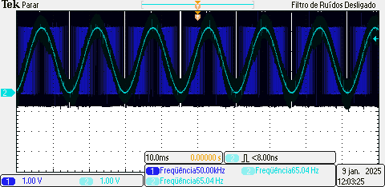

# Gerador de Funções Utilizando ESP32

Neste projeto, foi desenvolvido um gerador de funções utilizando o microcontrolador ESP32. O objetivo é criar um sistema capaz de gerar sinais elétricos periódicos com diferentes formas de onda, frequências e amplitudes, aplicando conceitos de **Sistemas Digitais 2**.

## 📚 Contexto

Os microcontroladores, como o ESP32, têm se tornado ferramentas indispensáveis para sistemas embarcados. Este projeto aproveita a capacidade de processamento do ESP32 para implementar um gerador de funções que pode ser usado em laboratórios de ensino e pesquisa.

## 🚀 Funcionalidades

- **Formas de onda suportadas**: 
  - Senoidal
  - Dente de serra
  - Triangular
  - Quadrada
- **Controle de parâmetros**:
  - Frequência
  - Amplitude
  - Seleção da forma de onda
- **Interface de usuário**:
  - Botões físicos para controle
  - Exibição da frequência configurada em um display LCD 16x2

## 🛠️ Componentes Utilizados

- **Microcontrolador**: ESP32-S3
- **Placa de desenvolvimento**: Prometheus (projetada pelo autor)
- **Outros componentes**:
  - Botões de controle
  - Display LCD 16x2
  - Osciloscópio para validação dos sinais gerados

## 📐 Metodologia

O sistema foi implementado utilizando os seguintes recursos do ESP32:
- **PWM**: Modulação por Largura de Pulso para gerar os sinais.
- **Temporizadores de hardware**: Para garantir precisão e fidelidade dos sinais.
- **Conversores DAC**: Alternativa explorada para geração de sinais analógicos.

Os sinais gerados foram filtrados por um filtro passa-baixas para suavizar componentes de alta frequência. 

## 📊 Resultados

Os testes realizados demonstraram a capacidade do sistema de gerar sinais precisos, com erro inferior a 1% entre as frequências desejadas e obtidas. O protótipo mostrou-se funcional para as formas de onda suportadas.

### Exemplos de sinais gerados:
1. Senoidal
2. Dente de serra
3. Triangular
4. Quadrada



## 🔧 Instalação e Uso

1. Clone este repositório:
   ```bash
   git clone https://github.com/miguellrodrigues/trabalho_sistemas_digitais.git
   ```

2. Configure o ambiente ESP-IDF para compilar e carregar o firmware.

3. Conecte os componentes físicos conforme o diagrama na pasta `/docs`.

4. Utilize os botões físicos para alterar os parâmetros do sinal.

## 📝 Referências

- Tocci, R.J., et al. **Sistemas Digitais: Princípios e Aplicações**, Pearson, 2016.
- Lathi, B.P., et al. **Modern Digital and Analog Communication Systems**, Oxford University Press, 2009.
- Haykin, S., et al. **Communication Systems**, Wiley, 2007.

## 🔮 Melhorias Futuras

- Adicionar interface gráfica para controle remoto via IoT.
- Expandir as formas de onda suportadas para incluir formas arbitrárias.
- Sincronização com outros dispositivos via protocolos de comunicação.

---

**Autor:** Miguel L. Rodrigues  
**Email:** [miguellukas52@gmail.com](mailto:miguellukas52@gmail.com)  
**Repositório:** [GitHub - Trabalho Sistemas Digitais](https://github.com/miguellrodrigues/trabalho_sistemas_digitais)